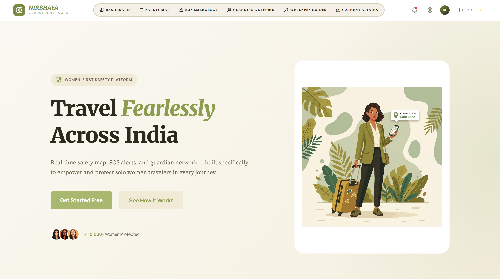
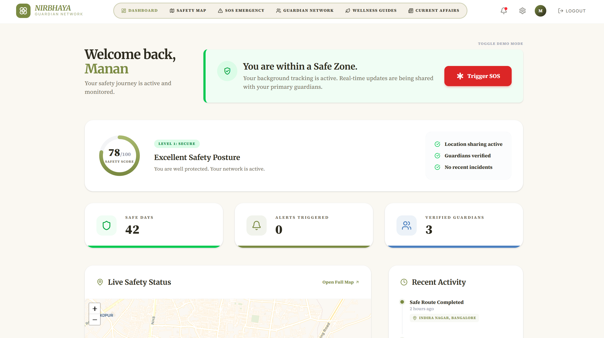
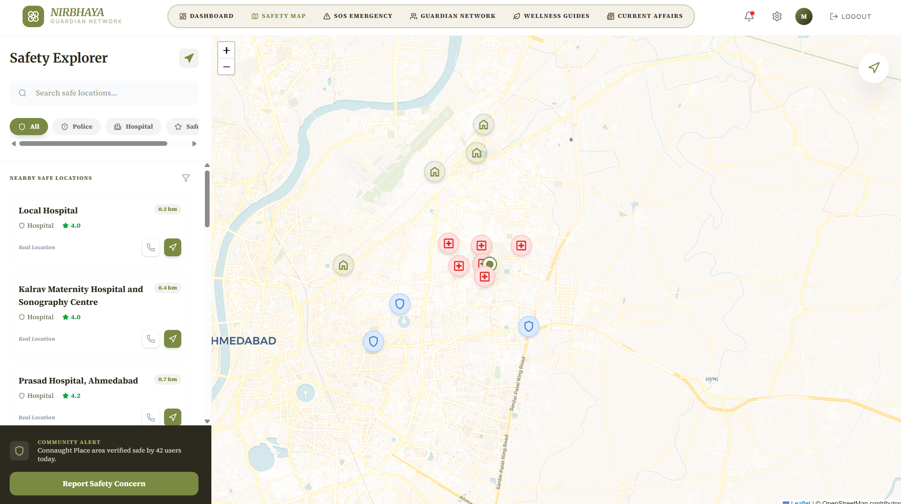
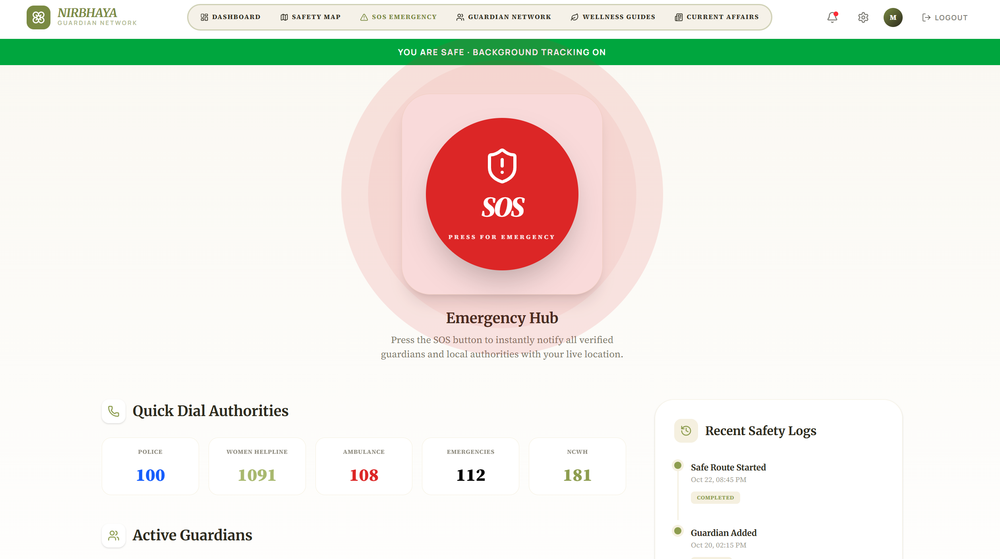
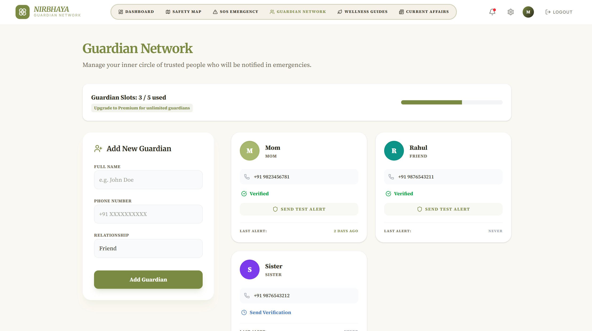
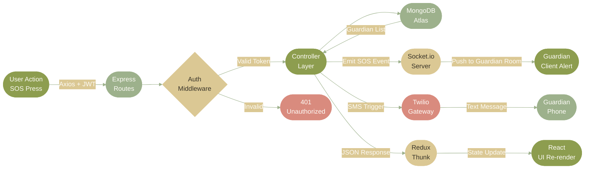

<div align="center">


<br>

[](https://github.com/mananjani2102/nirbhaya)

</div>


<br>

<div align="center">

## Quick Links

| Resource | Platform | Link |
|:--------:|:--------:|:-----|
| Live Frontend | Netlify | https://niirbhaya.netlify.app |
| Backend API | Render | https://nirbhaya-pqv4.onrender.com |
| Figma Design | Figma | https://www.figma.com/design/Jys56cwKCEalT0BSoBIKm6/Untitled?node-id=0-1&t=AuLDgFRiD1bRwEJi-1 |
| API Documentation | Postman | https://documenter.getpostman.com/view/50839334/2sBXqKnzCE |
| Demo Video | YouTube | https://youtu.be/1REXhOiRhKY |

</div>

<br>


<br>

<div align="center">

## Project Description

</div>

Nirbhaya is a full-stack women's safety platform built specifically for India. It combines a live safety map, one-press SOS alerts, a guardian network, fake call feature, and AI-powered route warnings into a single application. The platform is designed to work across 50+ Indian cities and supports offline usage for low-connectivity areas.

<br>


<br>

<div align="center">

## Problem Statement

</div>

```
  x  No single app combines safety map, SOS, and guardian network together
  x  Existing apps are generic — not built for Indian roads, cities, and context
  x  Emergency numbers are buried — not accessible in one tap under stress
  x  No way to silently alert trusted contacts when you feel unsafe
  x  Location sharing stops when you close the app — not continuous
  x  No offline support — useless in low-connectivity areas across India

  +  Nirbhaya consolidates everything — map, SOS, guardians, and alerts
  +  Live safety map with police stations, hospitals, and verified safe zones
  +  One-press SOS that instantly notifies all guardian contacts with live location
  +  Emergency numbers (100, 1091, 108, 112) always one tap away
  +  Continuous background location sharing with auto-stop when marked safe
  +  Offline safety map download for travel in low-connectivity regions
```

<br>

<div align="center">

<table>
<tr>
<td align="center" width="50%">

### Every Other Safety App


</td>
<td align="center" width="50%">

### Nirbhaya


</td>
</tr>
</table>

</div>

<br>


<br>

<div align="center">

## Feature Showcase

<table>
<tr>
<td align="center" width="25%">


**Live Safety Map**

Interactive map showing police stations, hospitals, and community-verified safe zones across 50+ Indian cities. Updated daily. Works offline after download.


</td>
<td align="center" width="25%">


**One-Press SOS**

Single tap triggers an emergency alert to all guardian contacts with live GPS coordinates, timestamp, and a Google Maps link. No typing needed under stress.


</td>
<td align="center" width="25%">


**Guardian Network**

Add trusted contacts as guardians. They receive real-time SOS alerts, location updates, and can track your journey until you mark yourself safe.


</td>
<td align="center" width="25%">


**Live Location Share**

Continuous background location sharing with your guardian circle. Auto-stops when you press "I am safe." Works even when the screen is locked.


</td>
</tr>
<tr>
<td align="center" width="25%">


**AI Safety Alerts**

Machine learning model analyzes your route, time of day, area crime data, and community reports to send predictive safety warnings before you enter a risk zone.


</td>
<td align="center" width="25%">


**Fake Call**

Schedule or instantly trigger a realistic fake incoming call to exit uncomfortable situations. Customizable caller name, number, and voice response.


</td>
<td align="center" width="25%">


**Emergency Numbers**

Police 100, Women Helpline 1091, Ambulance 108, National Emergency 112 — always one tap away on the SOS screen. Direct call without manually dialing.


</td>
<td align="center" width="25%">


**Secure Auth and Payments**

JWT-based registration and login. Subscription plans processed via Razorpay — UPI, card, net banking, and wallet supported. RBI compliant and 256-bit encrypted.


</td>
</tr>
</table>

</div>

<br>


<br>

<div align="center">

## Screenshots

</div>

> Upload your screenshots to `assets/screenshots/` in your repository and they will appear here.

<div align="center">

**Landing Page**



**Dashboard**



**Safety Map**



**SOS Screen**



**Guardian Network**



**Pricing Plans**


**Mobile View**


</div>

<br>


<br>

<div align="center">

## Subscription Plans

</div>

```
Nirbhaya offers three plans — Basic stays free forever. Upgrade only when you need more.

  BASIC HAVEN       ->  Rs. 0 / month — Free forever
                        Safety Map access
                        Basic Guardian Log (up to 3 contacts)
                        Standard SOS Alerts
                        Community Stories

  PREMIUM GUARDIAN  ->  Rs. 199 / month
                        Everything in Basic Haven
                        Live Emergency SOS Routing
                        Unlimited My Circles Groups
                        Offline Safety Maps Download
                        Priority Wellness Guides
                        AI Safety Alerts
                        Fake Call Feature

  ANNUAL SANCTUARY  ->  Rs. 1990 / year  (2 months free — saves Rs. 398)
                        All Premium Guardian Features
                        2 Months Free Included
                        Exclusive Annual Safety Workshops
```

<br>


<br>

<div align="center">

## Design Preview


&nbsp;

&nbsp;


<br><br>

<a href="https://www.figma.com/design/Jys56cwKCEalT0BSoBIKm6/Untitled?node-id=0-1&t=AuLDgFRiD1bRwEJi-1">
  
</a>

</div>

<br>


<br>

<div align="center">

## Tech Stack

### Frontend


<br><br>

<table>
<tr>
<th align="center">Layer</th>
<th align="center">Technology</th>
<th align="left">What it does in Nirbhaya</th>
</tr>
<tr>
<td align="center"></td>
<td align="center"><strong>React 18 + Vite</strong></td>
<td>Component-based architecture with fast HMR. All safety screens — map, SOS, dashboard, guardian network — built as isolated React components.</td>
</tr>
<tr>
<td align="center"></td>
<td align="center"><strong>Redux Toolkit</strong></td>
<td>Global state for auth, guardian list, SOS status, location sharing toggle, and subscription plan via async thunks and slices.</td>
</tr>
<tr>
<td align="center"></td>
<td align="center"><strong>React Router DOM v6</strong></td>
<td>Protected routes for all dashboard screens. Public routes for landing, login, and signup. Role-based routing for free vs premium features.</td>
</tr>
<tr>
<td align="center"></td>
<td align="center"><strong>Tailwind CSS v3</strong></td>
<td>Utility-first responsive design with warm parchment and sage green CSS variable tokens. Dark and light mode via data-theme attribute.</td>
</tr>
<tr>
<td align="center"></td>
<td align="center"><strong>Socket.io Client</strong></td>
<td>Receives real-time location updates from the server. Emits SOS events to guardian sockets. Maintains a persistent connection while location sharing is active.</td>
</tr>
<tr>
<td align="center"></td>
<td align="center"><strong>Leaflet + OpenStreetMap</strong></td>
<td>Renders the interactive safety map with custom illustrated pin markers for police, hospitals, and safe zones. Supports offline tile caching.</td>
</tr>
<tr>
<td align="center"></td>
<td align="center"><strong>Axios</strong></td>
<td>Centralized API client with JWT interceptor for all authenticated requests. Auto-refreshes token on 401 responses.</td>
</tr>
<tr>
<td align="center"></td>
<td align="center"><strong>Razorpay SDK</strong></td>
<td>Handles UPI, card, net banking, and wallet payments for Premium Guardian and Annual Sanctuary subscriptions. RBI compliant payment flow.</td>
</tr>
<tr>
<td align="center"></td>
<td align="center"><strong>React Helmet Async</strong></td>
<td>Injects dynamic meta tags, Open Graph tags, and canonical URLs per route for search engine indexing and social sharing previews.</td>
</tr>
<tr>
<td align="center"></td>
<td align="center"><strong>react-hot-toast</strong></td>
<td>Toast notifications for SOS triggered, guardian added, location shared, and payment success or failure events.</td>
</tr>
</table>

<br>

### Backend


<br><br>

<table>
<tr>
<th align="center">Layer</th>
<th align="center">Technology</th>
<th align="left">What it does in Nirbhaya</th>
</tr>
<tr>
<td align="center"></td>
<td align="center"><strong>Node.js + Express</strong></td>
<td>REST API server with modular route structure. Handles all auth, guardian, SOS, location, and subscription routes with global error middleware.</td>
</tr>
<tr>
<td align="center"></td>
<td align="center"><strong>Socket.io Server</strong></td>
<td>Manages real-time location broadcasting to guardian rooms. Fires SOS events to all connected guardian clients instantly on trigger.</td>
</tr>
<tr>
<td align="center"></td>
<td align="center"><strong>MongoDB + Mongoose</strong></td>
<td>Stores users, guardian relationships, SOS alert history, location logs, safe places, and subscription records with typed schemas.</td>
</tr>
<tr>
<td align="center"></td>
<td align="center"><strong>JSON Web Tokens</strong></td>
<td>Stateless authentication on all protected routes. Token verified by custom authMiddleware. Subscription tier embedded in token payload.</td>
</tr>
<tr>
<td align="center"></td>
<td align="center"><strong>Razorpay Node SDK</strong></td>
<td>Creates payment orders, verifies webhook signatures, and activates Premium or Annual plan on successful payment confirmation.</td>
</tr>
<tr>
<td align="center"></td>
<td align="center"><strong>Twilio / MSG91</strong></td>
<td>Sends SMS alerts to guardian phone numbers when SOS is triggered — ensures delivery even if the guardian does not have the app installed.</td>
</tr>
</table>

</div>

<br>


<br>

<div align="center">

## Data Flow Architecture



<br>


</div>

<br>


<br>

<div align="center">

## Folder Structure

</div>

```
nirbhaya/
|
+-- backend/
|   +-- config/
|   |   +-- db.js                     <- MongoDB Atlas connection via Mongoose
|   |   +-- socket.js                 <- Socket.io server initialization and room management
|   |
|   +-- controllers/
|   |   +-- authController.js         <- Register | Login | Get Profile | Refresh Token
|   |   +-- guardianController.js     <- Add | Remove | List | Alert All Guardians
|   |   +-- sosController.js          <- Trigger SOS | Alert History | Mark Safe
|   |   +-- locationController.js     <- Start Share | Update Location | Stop Share
|   |   +-- mapController.js          <- Nearby Places | Safe Zones | Add Community Place
|   |   +-- subscriptionController.js <- Create Order | Verify Payment | Activate Plan
|   |   +-- fakeCallController.js     <- Schedule Call | Instant Trigger | Cancel
|   |
|   +-- middleware/
|   |   +-- authMiddleware.js         <- JWT decode and user injection into req object
|   |   +-- premiumMiddleware.js      <- Blocks free users from accessing premium routes
|   |   +-- errorMiddleware.js        <- Global error formatting and logging
|   |
|   +-- models/
|   |   +-- User.js                   <- name | email | phone | password | plan | planExpiry
|   |   +-- Guardian.js               <- userId | guardianName | guardianPhone | addedAt
|   |   +-- SosAlert.js               <- userId | latitude | longitude | timestamp | resolved
|   |   +-- LocationShare.js          <- userId | latitude | longitude | isActive | updatedAt
|   |   +-- SafePlace.js              <- name | type | latitude | longitude | city | verified
|   |   +-- Subscription.js           <- userId | plan | razorpayOrderId | paymentId | expiry
|   |
|   +-- routes/
|   |   +-- authRoutes.js
|   |   +-- guardianRoutes.js
|   |   +-- sosRoutes.js
|   |   +-- locationRoutes.js
|   |   +-- mapRoutes.js
|   |   +-- subscriptionRoutes.js
|   |   +-- fakeCallRoutes.js
|   |   +-- index.js                  <- Mounts all route modules at /api
|   |
|   +-- server.js                     <- Express + Socket.io bootstrap + MongoDB connect
|   +-- .env
|   +-- package.json
|
+-- frontend/
|   +-- public/
|   +-- src/
|   |   +-- components/
|   |   |   +-- Navbar.jsx
|   |   |   +-- ProtectedRoute.jsx
|   |   |   +-- PremiumRoute.jsx
|   |   |   +-- MapView.jsx
|   |   |   +-- SosButton.jsx
|   |   |   +-- GuardianCard.jsx
|   |   |   +-- PlaceCard.jsx
|   |   |   +-- PricingCard.jsx
|   |   |   +-- PaymentModal.jsx
|   |   |   +-- FakeCallOverlay.jsx
|   |   |   +-- ConfirmModal.jsx
|   |   |
|   |   +-- context/
|   |   |   +-- ThemeContext.jsx
|   |   |   +-- SocketContext.jsx
|   |   |
|   |   +-- hooks/
|   |   |   +-- useGeolocation.js
|   |   |   +-- useSocket.js
|   |   |   +-- usePremium.js
|   |   |
|   |   +-- pages/
|   |   |   +-- Landing.jsx
|   |   |   +-- Login.jsx
|   |   |   +-- Signup.jsx
|   |   |   +-- Dashboard.jsx
|   |   |   +-- Map.jsx
|   |   |   +-- Sos.jsx
|   |   |   +-- Guardians.jsx
|   |   |   +-- Pricing.jsx
|   |   |   +-- Payment.jsx
|   |   |   +-- Settings.jsx
|   |   |
|   |   +-- redux/
|   |   |   +-- store.js
|   |   |   +-- authSlice.js
|   |   |   +-- guardianSlice.js
|   |   |   +-- sosSlice.js
|   |   |   +-- locationSlice.js
|   |   |   +-- mapSlice.js
|   |   |   +-- subscriptionSlice.js
|   |   |
|   |   +-- services/
|   |   |   +-- api.js
|   |   |   +-- socketService.js
|   |   |
|   |   +-- App.jsx
|   |   +-- main.jsx
|   |   +-- index.css
|   |
|   +-- tailwind.config.js
|   +-- vite.config.js
|   +-- package.json
|
+-- assets/
    +-- screenshots/
        +-- landing.png
        +-- dashboard.png
        +-- map.png
        +-- sos.png
        +-- guardians.png
        +-- pricing.png
        +-- mobile.png
```

<br>


<br>

<div align="center">

## Getting Started

<table>
<tr>
<td>

```
+==================================================================+
|                                                                  |
|   +----------------------------------------------------------+   |
|   |  TERMINAL                                          . . . |   |
|   +----------------------------------------------------------+   |
|   |                                                          |   |
|   |  $ git clone github.com/mananjani2102/nirbhaya           |   |
|   |  Cloning into 'nirbhaya'... done.                        |   |
|   |                                                          |   |
|   |  $ cd nirbhaya/backend && npm install                    |   |
|   |  added 112 packages in 7s                                |   |
|   |                                                          |   |
|   |  $ cp .env.example .env                                  |   |
|   |  # paste your MONGO_URI, JWT_SECRET, RAZORPAY keys       |   |
|   |                                                          |   |
|   |  $ npm run dev                                           |   |
|   |  + MongoDB connected                                     |   |
|   |  + Socket.io initialized                                 |   |
|   |  + Server running at http://localhost:5000               |   |
|   |                                                          |   |
|   |  $ cd ../frontend && npm install && npm run dev          |   |
|   |  + Frontend running at http://localhost:3000             |   |
|   |                                                          |   |
|   |  Nirbhaya is live. Travel without fear.                  |   |
|   |                                                          |   |
|   +----------------------------------------------------------+   |
|                                                                  |
+==================================================================+
```

</td>
</tr>
</table>

</div>

### Prerequisites


### 1 — Clone

```bash
git clone https://github.com/mananjani2102/nirbhaya.git
cd nirbhaya
```

### 2 — Backend Setup

```bash
cd backend
npm install
```

Create `.env` inside the `backend` folder:

```env
PORT=5000
MONGO_URI=your_mongodb_atlas_connection_string
JWT_SECRET=your_jwt_secret_key
NODE_ENV=development

RAZORPAY_KEY_ID=your_razorpay_key_id
RAZORPAY_KEY_SECRET=your_razorpay_key_secret

TWILIO_ACCOUNT_SID=your_twilio_account_sid
TWILIO_AUTH_TOKEN=your_twilio_auth_token
TWILIO_PHONE_NUMBER=your_twilio_phone_number
```

```bash
npm run dev    # -> http://localhost:5000
```

### 3 — Frontend Setup

```bash
cd ../frontend
npm install
```

Create `.env` inside the `frontend` folder:

```env
VITE_API_URL=http://localhost:5000/api
VITE_SOCKET_URL=http://localhost:5000
VITE_RAZORPAY_KEY_ID=your_razorpay_key_id
```

```bash
npm run dev    # -> http://localhost:3000
```

<br>


<br>

<div align="center">

## Environment Variables

### Backend `.env`

| Variable | Required | Description |
|:---------|:--------:|:------------|
| `PORT` | Yes | HTTP port for Express server |
| `MONGO_URI` | Yes | MongoDB Atlas connection string |
| `JWT_SECRET` | Yes | Secret string used to sign and verify JWT tokens |
| `NODE_ENV` | Yes | `development` or `production` |
| `RAZORPAY_KEY_ID` | Yes | Razorpay API key ID from dashboard |
| `RAZORPAY_KEY_SECRET` | Yes | Razorpay API key secret from dashboard |
| `TWILIO_ACCOUNT_SID` | Yes | Twilio account SID for SMS guardian alerts |
| `TWILIO_AUTH_TOKEN` | Yes | Twilio auth token |
| `TWILIO_PHONE_NUMBER` | Yes | Twilio sender phone number |

### Frontend `.env`

| Variable | Required | Description |
|:---------|:--------:|:------------|
| `VITE_API_URL` | Yes | Full backend API base URL ending in `/api` |
| `VITE_SOCKET_URL` | Yes | Backend root URL for Socket.io connection |
| `VITE_RAZORPAY_KEY_ID` | Yes | Razorpay key ID for client-side payment initialization |

</div>

<br>


<br>

<div align="center">

## API Reference


&nbsp;
<a href="https://documenter.getpostman.com/view/50839334/2sBXqKnzCE">
  
</a>

</div>

<br>

### Auth Routes — `/api/auth`

| Method | Endpoint | Description | Auth Required |
|:------:|:---------|:------------|:-------------:|
| `POST` | `/auth/register` | Register new user with name, email, phone, password | No |
| `POST` | `/auth/login` | Login and receive JWT token | No |
| `GET` | `/auth/profile` | Get authenticated user profile and plan details | Yes |

### Guardian Routes — `/api/guardians`

| Method | Endpoint | Description | Auth Required |
|:------:|:---------|:------------|:-------------:|
| `GET` | `/guardians` | List all guardian contacts for the logged-in user | Yes |
| `POST` | `/guardians` | Add a new guardian contact | Yes |
| `DELETE` | `/guardians/:id` | Remove a guardian contact by ID | Yes |
| `POST` | `/guardians/alert-all` | Manually send location alert to all guardians | Yes |

### SOS Routes — `/api/sos`

| Method | Endpoint | Description | Auth Required |
|:------:|:---------|:------------|:-------------:|
| `POST` | `/sos/trigger` | Trigger SOS — alerts all guardians via Socket.io and SMS | Yes |
| `POST` | `/sos/safe` | Mark user as safe — resolves all active alerts | Yes |
| `GET` | `/sos/history` | Fetch SOS alert history with timestamps | Yes |

### Location Routes — `/api/location`

| Method | Endpoint | Description | Auth Required |
|:------:|:---------|:------------|:-------------:|
| `POST` | `/location/start` | Start live location sharing session | Yes |
| `PUT` | `/location/update` | Push updated GPS coordinates to guardian room | Yes |
| `POST` | `/location/stop` | End location sharing session | Yes |

### Map Routes — `/api/map`

| Method | Endpoint | Description | Auth Required |
|:------:|:---------|:------------|:-------------:|
| `GET` | `/map/places` | Get nearby safe places by city or coordinates | Yes |
| `POST` | `/map/places` | Submit a new community-verified safe place | Yes |
| `GET` | `/map/places/:type` | Filter by type — police, hospital, safe-zone | Yes |

### Subscription Routes — `/api/subscription`

| Method | Endpoint | Description | Auth Required |
|:------:|:---------|:------------|:-------------:|
| `POST` | `/subscription/order` | Create a Razorpay order for selected plan | Yes |
| `POST` | `/subscription/verify` | Verify Razorpay payment and activate premium plan | Yes |
| `GET` | `/subscription/status` | Get current plan name and expiry date | Yes |

<br>


<br>

<div align="center">

## Error Handling

All endpoints return a consistent error envelope:

```json
{ "message": "Human-readable description of what went wrong" }
```

| Status Code | When It Fires |
|:-----------:|:--------------|
| `400` | Missing or invalid input — validation failure |
| `401` | Missing or expired JWT token |
| `403` | Valid token but insufficient plan — free user on premium route |
| `404` | Requested resource not found |
| `500` | Unhandled server-side exception |

</div>

<br>


<br>

<div align="center">

## Mobile Responsiveness


&nbsp;


</div>

Nirbhaya is fully responsive across all screen sizes. All pages including the Safety Map, SOS screen, Guardian Network, Pricing, and Authentication flows render correctly on mobile devices. The SOS button remains prominent and accessible on small screens. Navigation collapses into a mobile-friendly menu below 768px.

<br>


<br>

<div align="center">

## Deployment


&nbsp;

&nbsp;

&nbsp;


</div>

<br>

**Frontend — Netlify**

1. Connect GitHub repository on netlify.com
2. Set build configuration — Base Directory: `frontend`, Build Command: `npm run build`, Publish Directory: `frontend/dist`
3. Add all three frontend environment variables in the Netlify dashboard
4. Add a `_redirects` file inside `public/` with content `/* /index.html 200` for React Router support

**Backend — Render**

1. Create a Web Service on render.com and connect the repository
2. Set Root Directory: `backend`, Build Command: `npm install`, Start Command: `node server.js`
3. Add all backend environment variables from the Render dashboard
4. Enable WebSocket support in Render settings — required for Socket.io

**Database — MongoDB Atlas**

1. Create a free M0 cluster on MongoDB Atlas
2. Create a database user with read/write permissions
3. Whitelist all IPs `0.0.0.0/0` for Render compatibility
4. Copy the connection string and set it as `MONGO_URI`

<br>


<br>

<div align="center">

## Roadmap

<table>
<tr>
<th align="center">Priority</th>
<th align="left">Feature</th>
<th align="left">Description</th>
</tr>
<tr>
<td align="center"></td>
<td><strong>Mobile App — React Native</strong></td>
<td>iOS and Android port with native background location, push notifications, and offline map access</td>
</tr>
<tr>
<td align="center"></td>
<td><strong>Community Safe Place Verification</strong></td>
<td>Allow verified users to submit and upvote safe places with a moderation queue before appearing on the public map</td>
</tr>
<tr>
<td align="center"></td>
<td><strong>Trip Safety Mode</strong></td>
<td>Set a route and ETA — if the user does not check in by the deadline, SOS is auto-triggered</td>
</tr>
<tr>
<td align="center"></td>
<td><strong>Multi-language Support</strong></td>
<td>Hindi, Tamil, Telugu, Kannada, and Bengali UI translations for accessibility across India</td>
</tr>
<tr>
<td align="center"></td>
<td><strong>NGO and Shelter Partnerships</strong></td>
<td>Verified partnerships with registered NGOs, women's shelters, and police stations as trusted map points</td>
</tr>
<tr>
<td align="center"></td>
<td><strong>Safety Score per City</strong></td>
<td>Aggregate community reports into a per-city safety score displayed before travel</td>
</tr>
<tr>
<td align="center"></td>
<td><strong>Travel Companion Matching</strong></td>
<td>Opt-in feature to match solo travelers heading to the same destination — fully consent-based</td>
</tr>
</table>

</div>

<br>


<br>

## Contributing

1. Fork the repository and create a new branch: `git checkout -b feature/your-feature-name`
2. Write your changes with clean, tested code
3. Commit with a meaningful message: `git commit -m "feat: describe your change"`
4. Push to your fork: `git push origin feature/your-feature-name`
5. Open a Pull Request to `main` — describe what you changed and why

All new route handlers must include `try/catch` error handling and follow the existing controller pattern. Premium feature routes must pass through `premiumMiddleware`. No console errors, no untested edge cases, no hardcoded credentials in any file.

<br>

## License

This project is licensed under the [MIT License](LICENSE). Use it, fork it, build on it — for the safety of every woman who travels alone.

<br>


<br>

<div align="center">

## The Author

*Built with care and purpose — for every woman who has ever hesitated before stepping out alone.*

<br>

<table>
<tr>
<td align="center" width="100%">


### Manan Jani


*React · Redux · Node.js · Express · MongoDB · Socket.io · Tailwind*

</td>
</tr>
</table>

<br>

[](https://github.com/mananjani2102)

<br><br>


</div>